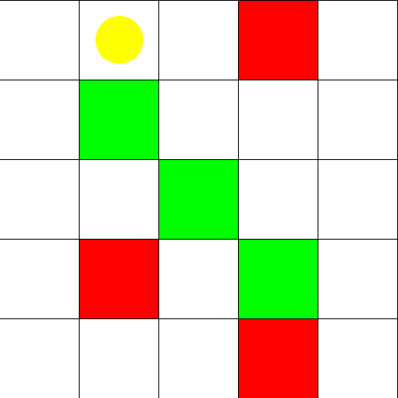

# Reinforcement Learning Project

This repository contains a reinforcement learning (RL) implementation for a mission grid environment where an agent navigates a 5x5 grid, aiming to collect positive rewards while avoiding negative ones. The agent's task is to maximize the cumulative reward by exploring and learning through interactions with the environment.



## Project Overview

In this project, we implement a reinforcement learning agent to solve a grid-based navigation problem. The agent starts at the top-left corner of the grid and must navigate towards cells containing positive rewards while avoiding negative rewards. The agent uses the **Deep Q-Network (DQN)** and **Proximal Policy Optimization (PPO)** methods to learn the best policies for the given environment.

### Key Components:
- **Grid Environment:** A 5x5 grid with positive and negative rewards.
- **DQN and PPO Algorithms:** Two RL techniques used to train the agent.
- **Agent Movement:** The agent can move up, down, left, or right.
- **Reward System:** Positive rewards (+1) and negative rewards (-1) placed at specific grid locations.
  
## Environment

The environment consists of a 5x5 grid with the following features:
- **Agent:** The agent is initially located at position (0, 0).
- **State Space:** The state space is represented as the grid, with each grid cell corresponding to a unique state.
- **Action Space:** The agent can perform one of four actions: up, down, left, or right (discrete actions).
- **Rewards:** The environment includes positive rewards (green cells) and negative rewards (red cells). The agent aims to maximize the cumulative reward by navigating to positive rewards while avoiding negative ones.

## Installation

### Requirements
- Python 3.x
- Gymnasium
- NumPy
- Matplotlib
- Stable-Baselines3 (SB3)

To install the necessary dependencies, use the following command:

```bash
pip install -r requirements.txt
```

### Running the Code

To train the DQN agent, run:

```bash
python train_dqn.py
```

To train the PPO agent, run:

```bash
python train_ppo.py
```

## Model Implementations

### DQN (Deep Q-Network)
- **Network Architecture:** The DQN uses a neural network to approximate the Q-values for each state-action pair.
- **Key Features:** 
  - Target networks and experience replay are utilized to improve learning stability.
  - A reward grid is used for training, where the agent receives positive or negative rewards based on its location in the grid.

### PPO (Proximal Policy Optimization)
- **Network Architecture:** PPO also uses a neural network to learn a policy that maps states to actions.
- **Key Features:** 
  - The policy is updated by performing multiple epochs over the collected experiences.
  - An entropy bonus is added to encourage exploration during training.

## Hyperparameters

### DQN Hyperparameters

| Hyperparameter          | Optimal Value |
|-------------------------|---------------|
| Learning Rate           | 0.001         |
| Gamma (Discount Factor) | 0.99          |
| Replay Buffer Size      | 100,000       |
| Batch Size              | 64            |
| Exploration Strategy    | Epsilon Decay|

**Summary:** These hyperparameters were chosen to balance exploration and exploitation, optimize the learning speed, and ensure stable performance over time.

### PPO Hyperparameters

| Hyperparameter          | Optimal Value |
|-------------------------|---------------|
| Learning Rate           | 0.0003        |
| Gamma (Discount Factor) | 0.99          |
| N Steps                 | 2048          |
| Batch Size              | 64            |
| N Epochs                | 10            |
| Entropy Coefficient     | 0.01          |

**Summary:** These hyperparameters were chosen to balance training stability, exploration, and efficiency during training.

## Training Results

### Cumulative Reward
- **DQN:** Cumulative rewards over episodes are plotted to show the agent's learning progress.
- **PPO:** The same metric is tracked for PPO.

### Training Stability
- **DQN:** Loss curves are plotted to observe the stability of the DQN model during training.
- **PPO:** The entropy values for the policy are tracked to ensure stable updates.

### Episodes to Convergence
- **DQN:** Took ~30,000 episodes to reach stable performance.
- **PPO:** Took ~50,000 episodes for convergence.

### Generalization
- Both trained models were tested on unseen initial states to evaluate their generalization ability.

## Conclusion

The DQN and PPO methods were successfully implemented and trained on the mission grid environment. **DQN** provided stable learning with good reward maximization, but **PPO** exhibited better generalization to unseen states. Improvements could include further tuning of hyperparameters or experimenting with more complex environments to test the robustness of these algorithms.
